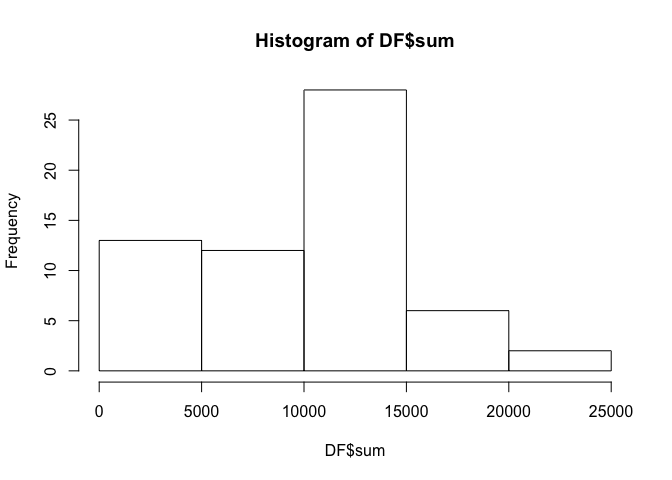
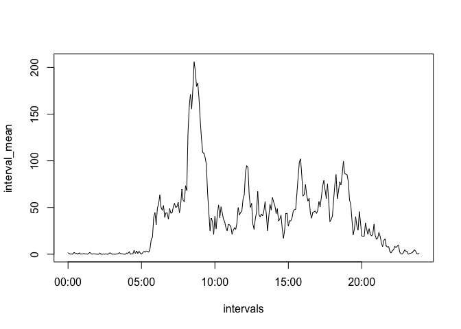
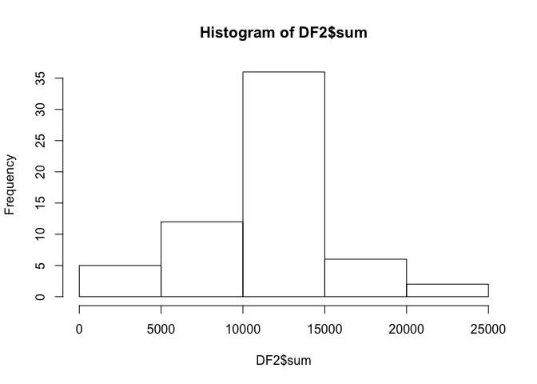
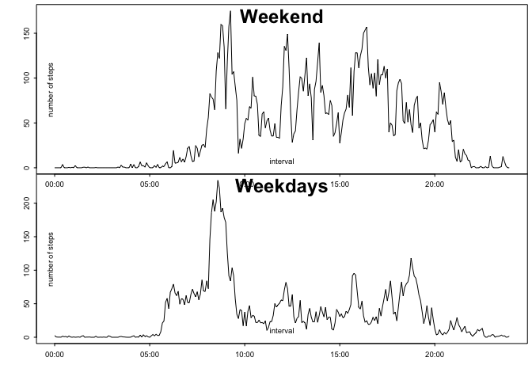

# Reproducible Research: Peer Assessment 1


## Loading and preprocessing the data
Data loaded from file "activity.csv".

```r
activity <- read.csv("activity.csv")
daily_total <- tapply(activity$steps, activity$date, sum, na.rm=TRUE)
DF <- data.frame(date=names(daily_total), sum=daily_total)
```


## What is mean total number of steps taken per day?
The histogram of the total number of steps per day:

```r
hist(DF$sum)
```

 

The mean of the total number of steps per day:

```r
mean(DF$sum)
```

```
## [1] 9354.23
```

The median of the total number of steps per day:

```r
median(DF$sum)
```

```
## [1] 10395
```

## What is the average daily activity pattern?

```r
interval_mean <- tapply(activity$steps, activity$interval, mean, na.rm=TRUE)
intervals<- strptime(sprintf("%04d", as.numeric(names(interval_mean))), format="%H%M")
plot(intervals, interval_mean, type="l")
```

 

Interval with maximum number of averaged steps:

```r
m <- max(interval_mean)
ind <- which(interval_mean==m)
names(interval_mean[ind])
```

```
## [1] "835"
```


## Imputing missing values
The number of missing values (NA) is:

```r
length(which(is.na(activity$steps)))
```

```
## [1] 2304
```
Replacing missing values with an average for all intervals and creating a new dataset:

```r
activity2 <- activity
activity2$steps[is.na(activity2$steps)] <- mean(activity2$steps, na.rm=TRUE)
```
Making a histogram of the new daily total number of steps:

```r
daily_total2 <- tapply(activity2$steps, activity2$date, sum, na.rm=TRUE)
DF2 <- data.frame(date=names(daily_total2), sum=daily_total2)
hist(DF2$sum)
```

 

The mean of the new total number of steps per day:

```r
mean(DF2$sum)
```

```
## [1] 10766.19
```

The median of new the total number of steps per day:

```r
median(DF2$sum)
```

```
## [1] 10766.19
```

Both mean and median number of steps per day increased in the second dataset. They also became identical, due to the choice of NA value replacement.

## Are there differences in activity patterns between weekdays and weekends?
This code divides the data into weekends and weekdays and then plots both on a panel plot.


```r
L <- (weekdays(as.Date(activity$date,'%Y-%m-%d'))=="Sunday") | (weekdays(as.Date(activity$date,'%Y-%m-%d'))=="Saturday")
L2 <- (weekdays(as.Date(activity$date,'%Y-%m-%d'))!="Sunday") & (weekdays(as.Date(activity$date,'%Y-%m-%d'))!="Saturday")

activity_weekend <- activity[L,]
activity_week <- activity[L2,]

interval_mean_weekend <- tapply(activity_weekend$steps, activity_weekend$interval, mean, na.rm=TRUE)

interval_mean_week <- tapply(activity_week$steps, activity_week$interval, mean, na.rm=TRUE)

par(mfrow = c(2, 1))
par(cex = 0.6)
par(mar = c(0, 0, 0, 0), oma = c(4, 4, 0.5, 0.5))
par(tcl = -0.25)
par(mgp = c(2, 0.6, 0))
layout=c(1,2)
plot(intervals, interval_mean_weekend, type="l")
title(main="Weekend", line=-2, xlab="interval", ylab="number of steps", cex.main=2.5)
plot(intervals, interval_mean_week, type="l")
title(main="Weekdays", line=-2, xlab="interval", ylab="number of steps", cex.main=2.5)
```

 

It is visible from the plots that the average number of steps during weekend starts later and is more evenly spread throughout the day than on weekdays. This is most likely because the test subjects sleep longer on weekends and don't walk as much during working hours on weekdays, when the number of steps drops off in comparison with weekends.


